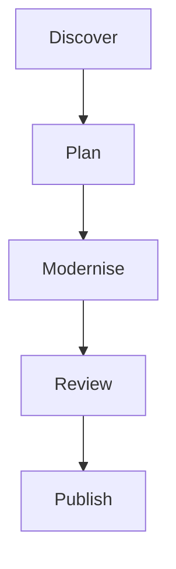

## Purpose

This Astro site hosts the Modernisation Kit for the Microsoft 365 Patterns and Practices community. It includes an overview, five modernisation stage pages, kit folder links, and community resources.

The kit is in development. The site labels unfinished guidance and assets accordingly; it does not perform SharePoint tenant operations.

## Local Development

Use Node.js 24 within a supported Astro LTS release. Node.js 20 is not supported by the installed Astro version.

Run these commands from the repository root:

```bash
cd site
npm ci
npm run dev
```

Open the local URL printed by Astro. No tenant account or credentials are required.

## Build and Validation

Run from the `site/` folder:

```bash
nvm use 24
npm ci
npm run build
npm run preview
```

The build generates six static pages in `dist/`. Before publishing, check the following at desktop and mobile widths:

* Follow all five workflow links and confirm that the active navigation matches the page.
* Follow previous and next stage links, including the overview and toolkit endpoints.
* Toggle the colour theme and confirm that it persists after navigation and reload.
* Navigate by keyboard and check the skip link and visible focus indicators.
* Check for clipped text, page overflow, and missing community images.

The build validates compilation but does not replace browser checks or tenant-connected validation.

## Content and Styling

* [BaseLayout.astro](src/layouts/BaseLayout.astro) owns shared navigation, theme tokens, typography, and the footer.
* [index.astro](src/pages/index.astro) contains the overview and resource links.
* [process.js](src/data/process.js) defines stage summaries, activities, outcomes, and the repository URL.
* The workflow stage content pages in `src/pages/*.mdx` use Astro MDX so they can host components when needed.

The current pages use local stage data. Additional content ingestion from `../docs/` remains future work.

Community resource images are served from the [PnP community site](https://pnp.github.io/) and require network access. Light and dark themes follow the system preference until changed; a valid `scoutTheme=light` or `scoutTheme=dark` URL parameter overrides the stored preference on page load.

## MDX rich media

MDX pages can now embed public-folder videos and Mermaid diagrams.

Place video files under `site/public/` and import the helper component in a nested `.mdx` page under `site/src/pages/<section>/...`:

```mdx
import PublicVideo from '../../components/PublicVideo.astro';

<PublicVideo
  src="/videos/modernization-demo.mp4"
  title="Modernization demo"
  caption="Walkthrough of the modernization workflow."
/>
```

The component applies the configured GitHub Pages base path, so `/videos/...` resolves correctly after deployment.

Mermaid diagrams should be authored directly in fenced `mermaid` code blocks. The site also normalises legacy `marmaid` fences as a compatibility fallback, but new content should use `mermaid`:



## Deployment

This repository includes a GitHub Actions workflow at `.github/workflows/deploy-pages.yml` that builds the Astro site from `site/` and deploys the generated `dist/` output to GitHub Pages by using the official GitHub Pages artifact upload and deployment actions.

Expected published URL:

* `https://pkbullock.github.io/modernization-kit/`

Trigger conditions:

* Pushes to `main` when files under `site/` change
* Pushes to `main` when `.github/workflows/deploy-pages.yml` changes
* Manual runs through **Actions** → **Deploy Astro site to GitHub Pages** via `workflow_dispatch`

One-time repository configuration:

1. Open **Settings** → **Pages**
2. Under **Build and deployment**, set **Source** to **GitHub Actions**

This documentation does not assume GitHub Pages is already enabled. After Pages is configured, successful workflow runs should publish the site to the URL above. No tenant-connected behavior is exercised by this deployment workflow.
