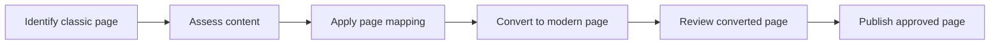

## Focus for this stage

* Validate mappings against representative source pages in a test environment.
* Run an agreed pilot with explicit write operations and structured conversion logs.
* Record unsupported content and conversion issues for review.

## What ConvertTo-PnPPage can do

The [ConvertTo-PnPPage cmdlet](https://pnp.github.io/powershell/cmdlets/ConvertTo-PnPPage.html)
turns a classic SharePoint page into a modern SharePoint page. It provides
options to control where the new page is created, what information is carried
across, and how the result is prepared for review.

### Convert different classic page types

* Convert wiki pages and web part pages to modern pages
* Convert publishing pages by using a page layout mapping file
* Convert classic blog posts and Delve blog posts
* Find source pages in Site Pages, another library, a library folder, or the
	root of a site collection

### Choose where the modern page is created

* Create the modern page in the source site or in another SharePoint site
* Move content between sites, tenants, or supported on-premises and SharePoint
	Online environments by using separate source and target connections
* Choose the target page name and folder
* Keep the source page name, with the classic page renamed for reference
* Replace a classic home page with a standard modern home page
* Overwrite an existing target page when that action is intentional

### Preserve useful page information

* Copy page metadata to the modern page
* Keep the original author, editor, created date, and modified date when the
	source page is in SharePoint Online
* Show the source page author in the modern page header
* Copy item-level page permissions, or skip them when the target site uses a
	different access model
* Map users and taxonomy terms when content moves between environments

### Control how content is transformed

* Use custom mappings to decide how classic web parts become modern web parts
* Use publishing page layout mappings to control the modern layout
* Rewrite links for the target site automatically, use a custom URL mapping
	file, or turn URL rewriting off
* Convert Summary Links web parts to Quick Links or plain HTML
* Replace classic Script Editor web parts with the community Script Editor
	web part when that component is available
* Keep or skip hidden web parts
* Remove empty sections and columns from the finished page
* Control how images found inside tables and lists are represented

### Prepare the page for review and publishing

* Leave the converted page unpublished so it can be reviewed first
* Publish the page and optionally promote it as news
* Disable comments on the new page
* Add a page acceptance banner when the required SPFx component is installed

### Record what happened

* Write conversion logs to a file, SharePoint, or the console
* Include verbose details for troubleshooting
* Combine log entries from multiple conversions into one log
* Clear cached web part information after installing or changing components

> __Note:__
> Conversion creates or updates a modern page. Test representative pages first,
> review custom mappings, and leave pages unpublished until their content,
> links, permissions, and layout have been approved.

## Stage pages

* [Conversion checklist](./conversion-checklist/)

## Before moving on

Hand over converted draft pages and their conversion records for review.
Conversion does not imply approval to publish.